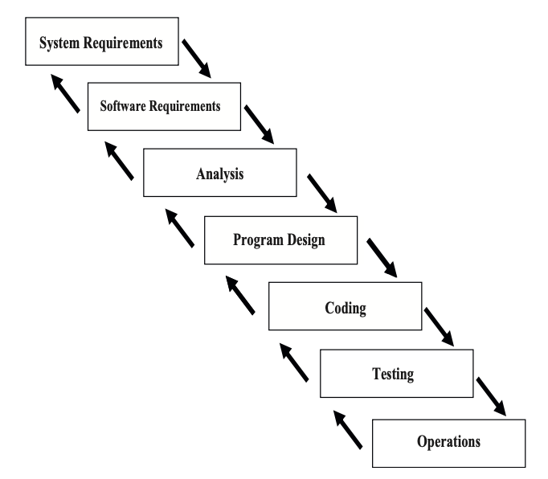

# Chapter 1: Software Crisis and Development Process

## 1.1 Software Crisis
在著名的軟體工程的 paper 《[No Silver Bullet—Essence and Accidents of Software Engineering](http://worrydream.com/refs/Brooks-NoSilverBullet.pdf)》中，有提到軟體的四個特性，造成了沒有一個針對軟體開發的一個簡單既有效的方法存在，這四個特性分別為：

* Complexity： 一個軟體元件可能需要數百甚至上千行的程式碼進行開發，導致系統中的元件個數和實際開發時常成指數成長
* Changeability：軟體系統可能一再隨著需求更改，導致系統維護和可擴充性變得重要
* Invisibility：軟體是將腦中想法的實作，常常解釋空間會抽象且模糊
* Conformity：系統和系統或介面和介面的介接，需要考量其一致性的問題

因此，我們需要將工程方法套用在實際軟體開發上，以減短開發時長並節省開發的資源。

## 1.2 Software Process Model

軟體開發的流程，過往的學者有系統化地去定義為下面幾個模型來增加軟體品質，主要就在規範開發週期中各個活動的順序性和架構：

* Waterfall Model
* Unified Process
* Extreme Programming (XP)
* Scrum

常見的軟體開發中的活動有：

* Requirement analysis：了解客戶的需求，分析針對該需求所建構的系統的可行性，分析需求和需求間的一致性和需求的正確性等等
* Design：針對需求轉換成系統的過程，其中包含了系統設計，系統中模組和模組間的介面設計，資料庫的設計，演算法和資料結構的設計
* Implementation：將系統設計轉成可運行程式碼的過程
* Test：避免程式碼發生的錯誤，或是針對一些特殊情境、edge case等等的測試，檢查模組的結果是否正確
* Maintain：當系統移交後，處理錯誤的修復和功能的新增和增強

其中，忽略任何一步都會造成軟體開發的困難度增加，舉例來說，軟體工程師常常跳過確認需求和設計的步驟直接進入實作，是利用 bottom-up 的開發模式，而沒有先行做全盤思考，導致可能模組和模組間的介面定義不明確，使得開發變時長變得冗長

## 1.3 Waterfall Model

Waterfall model 就是最為直覺的開發模型，就是將上述開發中的活動順序地執行，當每個活動完成後，產出文件後再進入下一階段，如下圖所示：

### 1.3.1 Pros and Cons
Waterfall model 有以下的優點：

* 開發階段分割明確，對於專案管理相對容易
* 有明確的測試點，容易檢驗並交接給後續階段清楚地進行
* 

## 1.4 Unified Process
### 1.4.1 Pros and Cons

## 1.5 Extreme Programming
### 1.5.1 Pros and Cons

## 1.6 Scrum
### 1.6.1 Pros and Cons