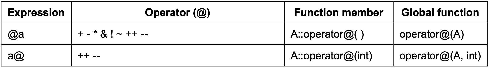
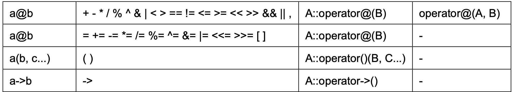

# C++: Object-Oriented Programming

## 1. Class
Class 就是將資料和 function 包裝成一個結構的方法，不同於 C 裡頭的 struct，struct 中只能包含資料，不能包含 function。

C++ 中 class 可以用下面方式宣告：

```
class class_name {
    permission_label_1:
       member1;
    permission_label_2:
       member2;
} object_name;
```
透過宣告定義的 class，我們就能創建 object，而 class 內部的成員如資料或 function 可以給定 permission label 為：

- private：只有該 class 的其他 member 或是該 class 的 friend class 可以存取得到。
- public：任何地方都可以存取得到該 member。
- protected：除了 private 可以存取得到的成員外，還多了子類別 derived class 可以存取得到。

以下面為例：

```
class Point {
    int x, y;
    public:
        void set_values(int, int);
        int distance_to_origin(void);
} point;
```
這裡定義了一個 class 為 Point，並宣告了該 class 的物件 point，這個 class 中共有 4 個 members，分別是：

- private: x, y
- public: set_values(), distance_to_origin() 的 prototype

可以注意到，如果沒有特別定義該 class 成員的 permission label 時，會被預設為 private。

因為 set_values 和 distance 皆為 public function，我們可以在外部存取：

```
point.set_value(3, 4);
distance = point.distance_to_origin();
```

但因為 class 中只有提供 function 的 prototype，我們可以利用 scope resolution operator ```::``` 來在 class Point 外來定義 function 內容。

下面為一完整示範：

```
#include <iostream>

class Point {
		int x, y;
	public:
		void set_values(int, int);
		int distance_to_origin(void);
		int get_x(void) {return x;}
		int get_y(void) {return y;}
} point;

void Point::set_values(int a, int b) {
	x = a;
	y = b;
}

int Point::distance_to_origin(void) {
	return x*x + y*y;
}

int main(void) {
	Point new_point;
	new_point.set_values(3, 4);
	std::cout << new_point.distance_to_origin() << std::endl;
	return 0;
}
```

scope resolution operator ```::``` 可以給予被定義的成員適當的範圍屬性，因為 set_values() 同屬 Point 的 class 中，所以可以直接引用 private 的 x, y members。

在 class 內部直接定義完整的函數，和只定義函數的原型而把具體實現放在 class 外部的唯一區別在於，在第一種情況中，編譯器(compiler) 會自動將函數作為 inline 考慮，而在第二種情況下，函數只是一般的 class 成員函數。

利用 private 的方式可以去保護 class 中的變數不被外界修改，只能透過 class 所提供的 function 來依 class 設計者所想的對 class 內的資料進行操作。

再來，透過 class 我們能造出不同的物件為 pointA 和 pointB 等等，而每個物件都有自有的變數 x, y。

另外，在 C++ 中不同於 C 的部分是 struct 同時可以有資料和 function，因此 struct 和 class 的功能相同，唯一的差別在：**class 定義的類別所有成員的默認存取權限為 private，而 struct 定義的類
別所有成員默認存取權限為 public**。

## 2. Constructors and Destructors

通常我們在宣告 object 時，會去初始化變數和分配動態記憶體，但在上面例子中，我們沒有初始化 Point 中的 x, y 值，

因此，我們在 class 中可以包含一個 constructor 的 function，來讓宣告一個該 class 的 object 時，會自動調用該 constructor 的 function 以初始化變數和分配動態記憶體。

下面就是 constructor 的定義方法：

```
#include <iostream>

class Point {
		int x, y;
	public:
		Point (int, int);
		int distance_to_origin(void);
		int get_x(void) {return x;}
		int get_y(void) {return y;}
};

Point::Point(int a, int b) {
	x = a;
	y = b;
}

int Point::distance_to_origin(void) {
	return x*x + y*y;
}

int main(void) {
	Point new_point (3, 4);
	std::cout << new_point.distance_to_origin() << std::endl;
	return 0;
}
```

可以看到，這邊的 ```Point::Point``` 就是 constructor function 的定義，會在宣告 Point 時初始化 x, y 值。

特別注意 constructor function 的定義不會有返回值。

而 destructor 則是和 constructor 相反的功能，他會在 object 被記憶體釋放時自動調用，destructor 主要用於當我們希望物件存在的 scope 結束時，我們希望釋放該 object 使用的空間時。

下面為一使用 destructor 的例子：

```
#include <iostream>

class Point {
		int *x, *y;
	public:
		Point (int, int);
		~Point ();
		int distance_to_origin(void);
		int get_x(void) {return *x;}
		int get_y(void) {return *y;}
};

Point::Point(int a, int b) {
	x = new int;
	y = new int;
	*x = a;
	*y = b;
}

Point::~Point() {
	delete x;
	delete y;
}

int Point::distance_to_origin(void) {
	return (*x)*(*x) + (*y)*(*y);
}

int main(void) {
	Point new_point (3, 4);
	std::cout << new_point.distance_to_origin() << std::endl;
	return 0;
}
```

## 3. Overloading Constructor

在 C++ 中有提供 function overload 的功能，可以提供一個統一名稱的 function，但不同的 arguments 來讓 compiler 選擇要對應使用的 function。

當我們定義 class 卻沒有定義 constructor 時，編譯器會自動假設兩個 overload constructor 為：

- empty constructor：沒有任何參數的 constructor，被定義為 nop，什麼都不會做。

```
Point::Point () {};
```

- copy constructor：只有一個參數的 constructor，這個參數為該 class 的 object，並將被傳入的 object 中所有 non-static member 的值都複製給這個 object。

```
Point::Point (const Point& point) {
	x=point.x; y=point.y;
}
```

要特別注意的是如果有定義 constructor 後，上面兩個預設的 overload constructor 就不存在了，必須自己定義。

我們也可以自己定義 overload constructor 如下：

```
#include <iostream>

class Point {
		int *x, *y;
	public:
		Point ();
		Point (int, int);
		~Point ();
		int distance_to_origin(void);
		int get_x(void) {return *x;}
		int get_y(void) {return *y;}
};

Point::Point() {
	x = new int;
	y = new int;
	*x = 3;
	*y = 4;
}

Point::Point(int a, int b) {
	x = new int;
	y = new int;
	*x = a;
	*y = b;
}

Point::~Point() {
	delete x;
	delete y;
}

int Point::distance_to_origin(void) {
	return (*x)*(*x) + (*y)*(*y);
}

int main(void) {
	Point new_point (3, 4);
	std::cout << new_point.distance_to_origin() << std::endl;
	return 0;
}
```

## 4. Class Pointer

Class 同樣可以使用 pointer 來存取，只要當 class 定義後，就是一種有效的 data type，可以直接用下面的方式宣告 class point：

```
Point *point;
```

和一般指標使用方式都相同，要利用 class pointer 來存取該 class 中的 member，可以使用 operator ```->```

如下例：

```
int main(void) {
	Point *p = new Point(3, 4);
	Point new_point = Point(5, 6);
	Point *pp = &new_point;
	std::cout << p->get_x() << std::endl;
	std::cout << p->get_y() << std::endl;
	std::cout << (*pp).get_x() << std::endl;
	std::cout << (*pp).get_y() << std::endl;
	return 0;
}
```

直接透過 operator ```p->member``` 來使用 Pointer 的 member function，也等價於使用：```(*p).member```

## 5. Overloading Operator

如果我們要在不同 class 間定義運算的話，就必須使用到  C++ overload 的能力，

舉例來說，我們可以直接利用 int 間使用 ```+``` 來做兩整數間的加法，但如果使用：

```
Point a, b, c;
c = a + b;
```
這樣的 class 加法時，我們就必須透過定義 overloading operator 來讓 compilier 知道 Point 間相加的運算要怎麼處理。

overloading operator 可以定義在 class 裡的 member function 中：

```
type operator sign (parameters);
```

舉例來說：

```
Point Point::operator+ (Point param) {
	Point temp;
	temp.x = x + param.x;
	temp.y = y + param.y;
	return temp;
}

Point Point::operator- (Point param) {
	Point temp;
	temp.x = x - param.x;
	temp.y = y - param.y;
	return temp;
}
```

就定義了在 Point 這個 class 間 ```+``` 和 ```-``` 的操作，我們可以直接用：

```
Point a, b, c;
c = a + b;
```

或是：
```
c = a.operator+ b;
```

而通常，assignation operator 會被自動定義，如果沒有特別指定：
```
c = a;
```
代表的是將等號右邊的物件中的 non-static member 複製到等號左邊的物件。

而常見可以 overload 的 operator 如下圖所示：




下面是一個 prefix 和 postfix increment operator 的實作範例：

```
Point& Point::operator++(void) {
	*x = *x + 1;
	*y = *y + 1;
	return *this;
}

Point Point::operator++(int) {
	Point temp = *this;
	++*this;
	return temp;
}
```

可以看到的是，這裡先定義了 prefix increment operator，再利用 prefix 去定義 postfix。

可以注意到的是，我們可以定義 overloading operator 為 member function 或是 global function，但要特別注意的是 global function 如果不是該 class 的 friend function，就不能存取到該 class 的 private 或 protected member。

## 6. This

我們可以透過 ```this``` 關鍵字來在 class 內部取得該 class 的 object 的記憶體位址，```this``` 就是一個 pointer，指向該 class 建構的 object 的記憶體位址。

如下所示：


下面就是使用到 this 的一個例子：

```
#include <iostream>

using namespace std;

class A {
	public:
		int isitme(A *ptr) {
			if (ptr == this) return 1;
			else return 0;
		}
		int* get_address_of_this() {
			return (int*)this;
		}
};

int main(void) {
	A obj;
	A obj2;
	cout << ((obj.isitme(&obj))? "It's me!": "It's not me.") << endl;
	cout << ((obj.isitme(&obj2))? "It's me!": "It's not me.") << endl;
	cout << "&obj: " << &obj << endl;
	cout << "This: " << obj.get_address_of_this() << endl;
	return 0;
}
```

而 ```this``` 關鍵字也常常用於 assignation operator overloading 中，如下所示：

```
Point& Point::operator=(const Point& param) {
	x = param.x;
	y = param.y;
	return *this;
}  