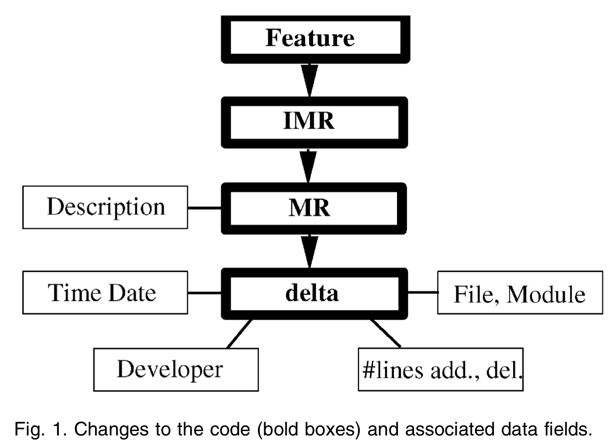

# Note on "Does Code Decay? Assessing the Evidence from Change Management Data"

Paper: [Does code decay? Assessing the evidence from change management data](https://ieeexplore.ieee.org/document/895984)

## Introduction

雖然軟體理應是不會隨著時間改變的，但因為下面兩點原因，而造成軟體的更新：

- Hardware or OS upgrade
- The required functionality changes abruptly.

因此，在維護軟體階段時，會因為上述兩點因素，必須不斷更新軟體，而作者在這維護過程時發現 code decay 的現象，並且該現象造成的維護困難性。

這篇論文實際為 code decay 建立了一個模型來準確分析和描述怎樣判斷 code decay。

> A unit of code (in most cases, a module) is decayed if it is harder to change than it should be, measured in terms of effort, interval, and quality.

並提出了 code decay indices 來量化 code decay 的程度。

再來利用他們提出來的模型和量化方法在一個有效力的 dataset 上進行分析，基於下面的幾點結果，的確可以證明 code 的確會 decay：

- Span of changes： The increase over time in the number of files touched per change to the code
- Breakdown of modularity： The decline in modularity of a subsystem of the code, as measured by changes touching multiple modules
- Fault potential： Contributions of several factors (notably, frequency and recency of change) to fault rates in modules of the code
- Prediction of effort： The span and size of changes are important predictors (at the feature level) of the effort to implement a change.

並且該套分析方法和模型不僅只適用於該 dataset，同時也適用於其他的 software project，i.e. code decay 是一個在軟體專案中普遍的現象。

## Methodology

### Changes to Software

首先，需要先定義 What is the change to software：

> A change is any alteration to the software recorded in the change history database.

而 software change 主要又可以分為三類：

- Adaptive change: 為軟體系統增加新功能，或是改寫到適應於新的硬體或作業系統。
- Corrective change: 為了解掉軟體系統裡的 issue。
- Perfective change: 為了方便後續維護所做的更新。

#### The Change Process
下圖為該篇 paper 研究的系統的 change process：

### Conceptual Model for Code Decay

### Code Decay Indices

## Experimental Results

### The Evidence of Decay

